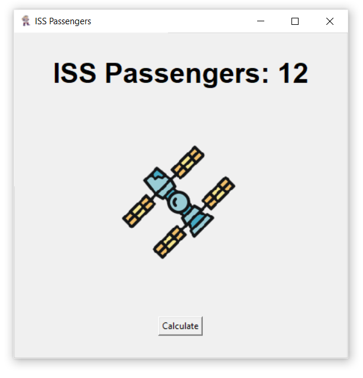

# 🛰️ ISS Passengers Counter – Live Tracker of Humans in Space

**ISS Passengers Counter** is a lightweight GUI app built with Python and Tkinter that shows how many people are currently aboard the International Space Station.  
It fetches real-time data using an external API, giving you a quick and fun way to peek into space activity!

---

**The Mission:**  
This mini tool is designed to bring space curiosity into your desktop.  
With just a click, you can find out how many astronauts are floating above Earth right now — it's educational, surprising, and geeky-cool!

---

## 💻 Download for Windows

🔗 [Download Now!](https://github.com/mshikebkhan/iss-passenger-counter/releases/download/v1.0.0/ISS-PassengerCounter.exe)

---

## 🚀 Features

🛰️ Real-Time Data – Get live count of humans currently aboard the ISS  
🌐 API-Based – Uses the Open Notify public API  
📦 Lightweight – Small `.exe` size, quick to load  
🧠 Educational – Great for students or space lovers  
🖥️ Standalone App – No installation required, just run and see

---

## 📸 Screenshots

| Screenshot | Description |
|------------|-------------|
|  | Main Window displaying live ISS passenger count |

---

## 🛠 Tech Stack

- **Language:** Python  
- **GUI:** Tkinter  
- **API:** Open Notify (http://api.open-notify.org/astros.json)
- **Build Tool:** PyInstaller

---

## ⚙️ Local Setup

```bash
git clone https://github.com/mshikebkhan/iss-passenger-counter.git
cd iss-passenger-counter
python -m venv venv
venv\Scripts\activate         # For Windows
pip install -r requirements.txt
python main.py
```
---

## 👥 Contributing

1. Fork the repository
2. Create your feature branch: `git checkout -b feature-name`
3. Commit your changes
4. Push to your branch
5. Open a Pull Request 🚀

---

## 📌 TODO Ideas

- Add clicking sounds to buttons
- Show names of all astronauts available in ISS
- Or anything else you think of!

---

## 📄 License

[MIT License](LICENSE)

---

Made with ❤️ by Shikeb Khan


